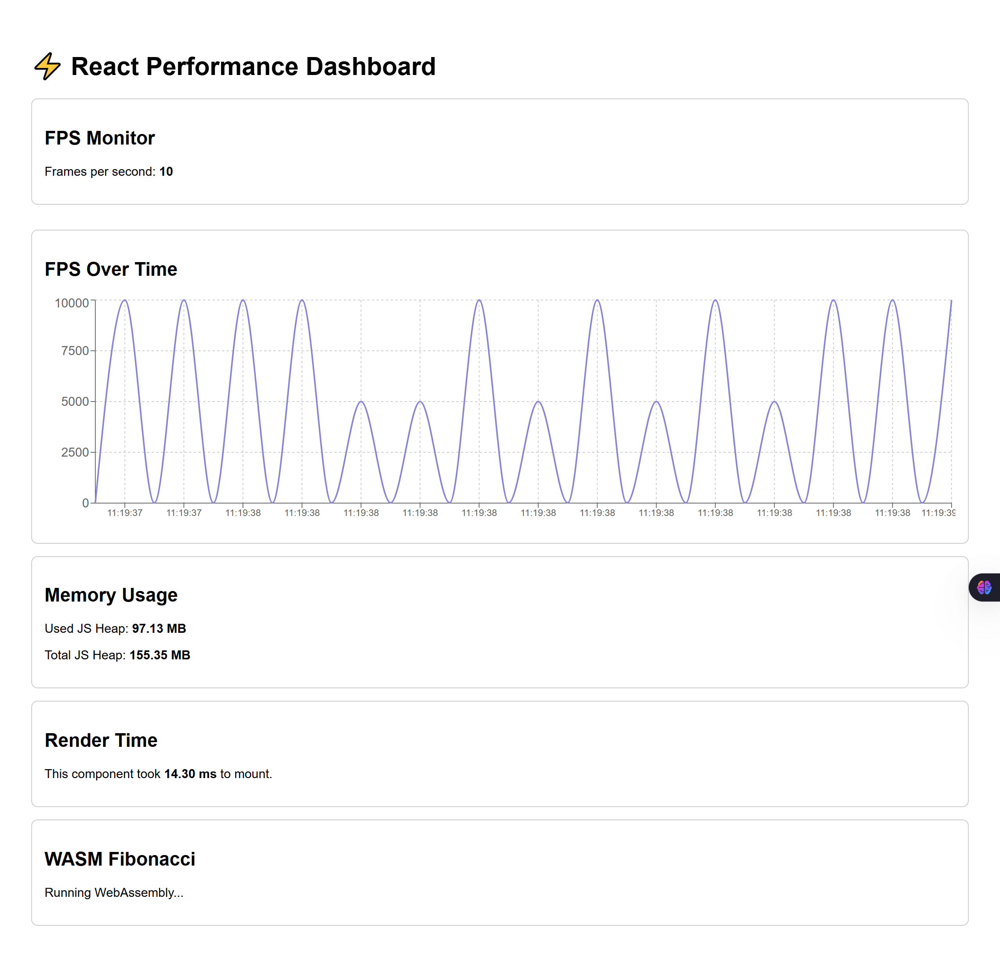

# 📊 react-performance-dashboard

A React-based dashboard to monitor and visualize frontend performance metrics like FPS, memory usage, and render time using Web APIs and optional WebAssembly (WASM).

A real-time dashboard to monitor key frontend performance metrics
FPS • Memory Usage • Render Time • WASM Integration • Lazy Loading • Recharts Visualization

## 🎯 Features

- FPS Monitoring using requestAnimationFrame
- Memory Usage Tracking via performance.memory (Chrome only)
- Component Render Time via performance.now()
- Real-Time Charting with Recharts
- Lazy Loading and React.Suspense
- WebAssembly (WASM) integration for heavy calculations
- Responsive UI using Tailwind CSS
- Built with React + Vite

## 🧠 What I Learned

- Measuring FPS & memory via Web APIs
- Optimizing components using lazy loading & code splitting
- Integrating native WebAssembly modules compiled from C
- Visualizing live data with Recharts
- Performance profiling with Chrome DevTools

## 📦 Tech Stack

- React 18
- Vite
- Tailwind CSS
- Recharts
- WebAssembly (Emscripten + C)
- JavaScript (ES6+) / Web APIs
- Chrome DevTools

## 📸 Screenshots

## 📁 Project Structure

react-performance-dashboard/
├── public/
│   └── wasm/              # WebAssembly .wasm files
├── src/
│   ├── components/        # FPS, Memory, WASM, Charts
│   ├── utils/             # WASM loader
│   ├── App.jsx
│   └── main.jsx
├── wasm-src/              # C source files for WASM
├── .gitignore
├── package.json
└── README.md

## ⚙️ How to Run

# Clone the repo
git clone https://github.com/anjan-in/react-performance-dashboard.git
cd react-performance-dashboard

# Install dependencies
npm install

# Run the dev server
npm run dev

# React + Vite

This template provides a minimal setup to get React working in Vite with HMR and some ESLint rules.

Currently, two official plugins are available:

- [@vitejs/plugin-react](https://github.com/vitejs/vite-plugin-react/blob/main/packages/plugin-react) uses [Babel](https://babeljs.io/) for Fast Refresh
- [@vitejs/plugin-react-swc](https://github.com/vitejs/vite-plugin-react/blob/main/packages/plugin-react-swc) uses [SWC](https://swc.rs/) for Fast Refresh

## Expanding the ESLint configuration

If you are developing a production application, we recommend using TypeScript with type-aware lint rules enabled. Check out the [TS template](https://github.com/vitejs/vite/tree/main/packages/create-vite/template-react-ts) for information on how to integrate TypeScript and [`typescript-eslint`](https://typescript-eslint.io) in your project.

## 🧪 Compile WASM (Optional)

Make sure Emscripten is installed.

`emcc wasm-src/fibonacci.c -Os -s WASM=1 -s SIDE_MODULE=1 -o public/wasm/fibonacci.wasm`

## 👨‍💻 Author
ANJAN SEN - 
Built as part of my application for Frontend Engineer @ Adobe

## 🚀 Live Demo
- Check here: 🌐[react-performance-dashboard.vercel.app](https://react-performance-dashboard.vercel.app/)

## 📬 Contact
Feel free to reach out!
- Email: anjansen30@gmail.com
- LinkedIn: [linkedin.com/in/anjansen-tech/](https://www.linkedin.com/in/anjansen-tech/)

## 🧡 Credits
Made with ❤️ by **Anjan Sen**

## ⭐ Show Your Support
If you like this project, please consider giving it a star ⭐ and sharing it!

---
© 2025 Anjan Sen. All rights reserved.